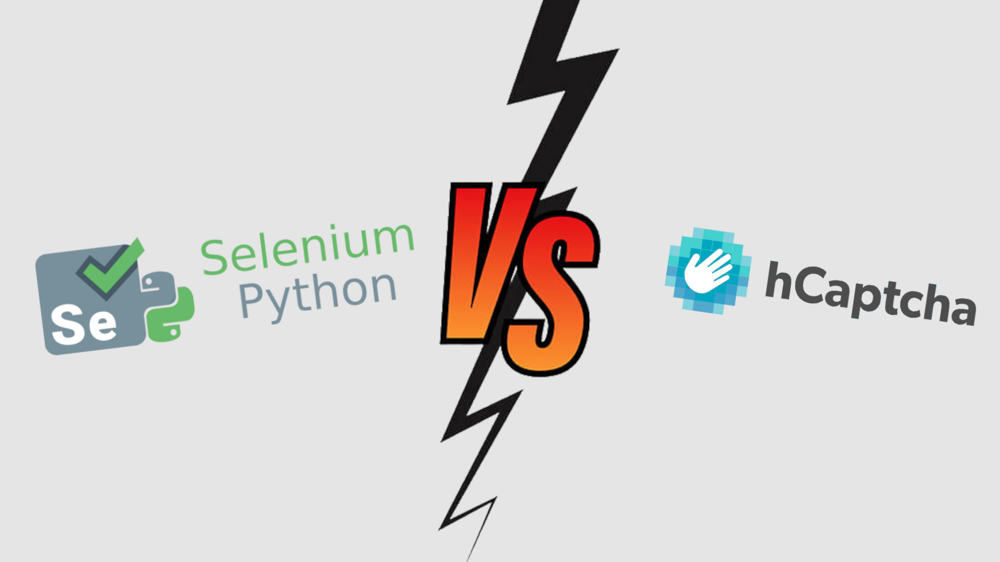

# Selenium-hCpatcha-Solver-Python

<center>
    
</center>

### What Is This Project?
This is a 'human like' hCaptcha solver for selenium written in python, it utilises the api provided by [anycaptcha](https://anycaptcha.com/) and is mainly focused for people who can't solve a captcha through a callback function and need to stay as undetected as possible.

### How Can I Run The Example?
1. Install the requirements needed
```vim
pip3 install -r requirements.txt 
```

2. Place your anycaptcha api key in the config.json file
```vim
{
  "api_keys" : {
    "anycaptcha" : "ENTER_YOU_API_KEY_HERE"
  }
}
```

3. Run The example.py file and configure the driver if there are any errors which occur
```vim
python3 example.py
```